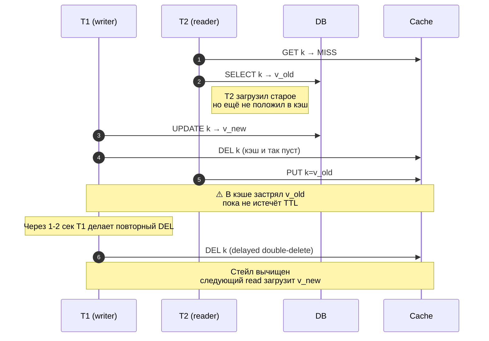

# Cache Consistency

> *"There are only two hard things in Computer Science: cache invalidation and naming things."* — Phil Karlton

## Двойная запись (double-write problem)

При write нужно изменить **два** хранилища: БД и кэш. Между ними — гонка.

Возможные порядки:

### 1. Write DB → write Cache
```
T1: db.update(k, v_new)
T1: cache.put(k, v_new)
```
**Проблема:** между шагами crash → стейл в кэше; или другой write успеет с v_old → race на cache.put.

### 2. Write Cache → write DB
```
T1: cache.put(k, v_new)
T1: db.update(k, v_new)
```
**Проблема:** если БД упала — кэш ушёл вперёд БД. Реплики БД пришлют v_old, и инвалидация на основании БД будет некорректной.

### 3. Write DB → invalidate Cache (most common)
```
T1: db.update(k, v_new)
T1: cache.invalidate(k)
```
**Проблема:** между шагами читатель может прочитать v_old из БД и закэшировать его → stale застревает.
```
T1: db.update(k, v_new)        ──┐
T2: cache.miss → db.read(k=v_new) │
T2: cache.put(k, v_new)           │ Тут T2 закэшировал v_new
T1: cache.invalidate(k)         ──┘ Но T1 это сразу инвалидировал
... всё ок
```
Худший случай:
```
T2: cache.miss → db.read(k=v_old)    // T2 прочитал ДО update'а T1
T1: db.update(k, v_new)
T1: cache.invalidate(k)               // инвалидируем (хотя кэш ещё пуст)
T2: cache.put(k, v_old)               // T2 кладёт стейл!
```
**Решение:** **Delayed Double-Delete** — повторная инвалидация через 1–2 секунды (после возможной задержки T2).



`Delayed Double-Delete` реализуется через `ScheduledExecutor` или Kafka delayed message. Альтернатива — versioned keys (см. ниже), которые исключают эту race condition by design.

### 4. Invalidate Cache → write DB
```
T1: cache.invalidate(k)
T1: db.update(k, v_new)
```
**Проблема (хуже всего):** между шагами читатель прогрузит из БД старое и закэширует:
```
T1: cache.invalidate(k)
T2: cache.miss → db.read(k=v_old)
T2: cache.put(k, v_old)
T1: db.update(k, v_new)            // в кэше осталось v_old и НИКТО его не выкинет
```
Это **самый частый источник** "стейл застрял на TTL". Не используй этот порядок.

---

## Стратегии invalidation

### TTL-based (eventual consistency)
Просто положить TTL=N и не инвалидировать на write. При следующем чтении (после TTL) подтянется свежее.

**Плюсы:** просто, нет race condition.
**Минусы:** stale до TTL. Не подходит для строгих требований.

Окей для: справочников, профилей с допустимым stale (минуты).

### Event-driven invalidation
На write публикуется событие в Kafka/Redis pub-sub → подписчики (включая инстансы near-cache) удаляют локально.

**Плюсы:** stale ограничен latency event'а (мс).
**Минусы:** добавляет messaging инфру; на потерю event'а нужен fallback на TTL.

### CDC (Change Data Capture)
Debezium / Maxwell / native binlog reader → читает WAL/binlog БД → публикует events → инвалидация.

**Плюсы:** **никакого кода в `db.update()`** — кэш инвалидируется автоматически на любую запись (даже из других сервисов, миграций, ad-hoc UPDATE).
**Минусы:** инфра (Kafka Connect, etc.); replication lag (≤ секунды).

**Минимальный Debezium pipeline:** Postgres → Kafka Connect (Debezium) → Kafka topic `users.public.users` → consumer-сервис → `cache.invalidate(...)`. Конфиг коннектора:

```json
{
  "name": "users-connector",
  "config": {
    "connector.class": "io.debezium.connector.postgresql.PostgresConnector",
    "database.hostname": "pg-master",
    "database.dbname": "app",
    "database.server.name": "users",
    "table.include.list": "public.users",
    "plugin.name": "pgoutput",
    "publication.autocreate.mode": "filtered"
  }
}
```

Каждый UPDATE/INSERT/DELETE в `public.users` ⇒ событие в Kafka ⇒ ваш consumer вызывает `cache.invalidate("user:" + event.id)`. Сервисы, выполняющие `UPDATE`, не знают про кэш — это огромный плюс. Tutorial: [Debezium tutorial: Postgres](https://debezium.io/documentation/reference/stable/tutorial.html).

### Versioned keys
Вместо удаления — увеличить версию.

```
db.update(user_42, ...)
redis.INCR ver:user:42        // → 7

// read:
v = redis.GET ver:user:42     // 7
data = redis.GET user:42:v7   // если miss → загрузить из БД
```

**Плюсы:** атомарно (один Redis операция); старые версии eventually evict-нутся; нет race на инвалидацию.
**Минусы:** двойной запрос к Redis (можно совместить через MGET / Lua); накладные расходы памяти.

Хорошо подходит для near-cache: каждый инстанс берёт версию, и не нужна кросс-нодовая инвалидация — все читают по актуальной версии.

### Stale-while-revalidate
Возвращать stale моментально + триггерить refresh в фоне. Cм. [HTTP_CDN_CACHE.md](HTTP_CDN_CACHE.md) для HTTP-варианта; в Caffeine — `refreshAfterWrite`.

---

## Read-after-write consistency

Сценарий: пользователь обновляет профиль, сразу читает → должен видеть свежее.

**Проблемы:**
- Если `update DB → invalidate cache → read` — read может попасть в реплику БД (которая ещё не получила обновление) → закэшируется стейл.
- Решение: **direct path** — после write читать из master DB и **сами** обновить кэш. Не доверять круговому пути.

```kotlin
fun update(user: User) {
    masterDb.update(user)
    cache.put("user:${user.id}", user)   // вместо invalidate
    publish("user:${user.id}:invalidate") // другим инстансам near-cache
}
```

---

## Two-phase: cache invalidation на распределённой транзакции

Если запись охватывает несколько сервисов (Saga, Outbox), инвалидация — часть outbox'а:
```
1. tx { db.update(); outbox.append("invalidate user:42") }
2. relay → publish("invalidate user:42")
3. подписчики → cache.invalidate("user:42")
```

См. [`../../microservices/theory/DISTRIBUTED_TRANSACTIONS.md`](../../microservices/theory/DISTRIBUTED_TRANSACTIONS.md) — Outbox pattern.

---

## Грабли

1. **Кэширование результатов SELECT с join'ом:** инвалидация при изменении любой из таблиц — кошмар. Лучше кэшировать атомарные сущности и собирать на app-уровне.
2. **Кэширование пагинированных списков:** изменение одного элемента обнуляет десятки страниц.
3. **Negative caching null'ов с длинным TTL:** удалили из БД, потом восстановили — стейл "не существует" живёт TTL'ом.
4. **Запись в read-only replica:** с последующей инвалидацией кэша на основании read replica → стейл (replication lag).
5. **Игнор time skew между узлами:** TTL основанные на wall clock могут расходиться. Redis для TTL использует logical time; для near-cache — `System.nanoTime` для длительностей.

---

## Когда консистентность не нужна

Если 100ms stale допустим — **TTL = 100ms** и забудь про инвалидацию. Это даёт:
- 1 запрос/100ms к БД на ключ (защита от stampede через single-flight в Caffeine)
- максимальный stale = 100ms
- ноль кода инвалидации

Часто это лучшее решение для read-heavy сервисов с миллионами RPS.

## Real-world кейсы

- **Stripe — idempotency keys.** Каждый POST к API сохраняется по уникальному ключу клиента; Redis-кэш записывает `idempotency_key → response`. Это фактически write-through кэш на критичный endpoint. Консистентность гарантируется не invalidation, а атомарной записью + TTL ([Stripe blog: Designing robust and predictable APIs with idempotency](https://stripe.com/blog/idempotency)).
- **GitHub repository cache.** Каждое изменение конфига репозитория (collaborators, branches) триггерит fan-out invalidation в десятки edge-кэшей через Sidekiq job — event ingestion идёт через внутреннюю платформу Hydro.
- **Linkedin — Espresso + Databus.** Внутренний CDC-pipeline (предшественник Debezium идеи) — реплицирует mutation log в Kafka, который потом инвалидирует кэши, обновляет search index, etc. ([LinkedIn engineering: Databus](https://engineering.linkedin.com/data-replication/open-sourcing-databus-linkedins-low-latency-change-data-capture-system)).
- **Shopify** использует флаг-based invalidation для каталогов: «версия каталога» хранится в Redis, все ключи генерируются с этим суффиксом. На обновление каталога просто INCR версии — старые ключи мгновенно перестают находиться (eventually evict-нутся).

## См. также

- Cache patterns → [CACHE_PATTERNS.md](CACHE_PATTERNS.md)
- Anti-patterns (stampede, breakdown) → [ANTI_PATTERNS.md](ANTI_PATTERNS.md)
- CAP и распределённые системы → [`system-design/theory/distributed_systems.md`](../../system-design/theory/distributed_systems.md)
- Outbox / Saga → [`../../microservices/theory/DISTRIBUTED_TRANSACTIONS.md`](../../microservices/theory/DISTRIBUTED_TRANSACTIONS.md)

## Источники

**Official docs:**
- [Debezium tutorial](https://debezium.io/documentation/reference/stable/tutorial.html)
- [Confluent: Change data capture (CDC) explained](https://www.confluent.io/learn/change-data-capture/)

**Engineering blogs:**
- [Stripe: Designing robust and predictable APIs with idempotency](https://stripe.com/blog/idempotency)
- [LinkedIn Databus: open-sourcing low-latency CDC](https://engineering.linkedin.com/data-replication/open-sourcing-databus-linkedins-low-latency-change-data-capture-system)
- [Murat Demirbas blog (cache invalidation papers)](https://muratbuffalo.blogspot.com/)

**Books:**
- *Designing Data-Intensive Applications* (Kleppmann), Ch. 5 (Replication, including read-your-writes consistency) и Ch. 11 (Stream Processing, CDC).
- *Database Internals* (Alex Petrov), Ch. 13 — replication and consistency models.
