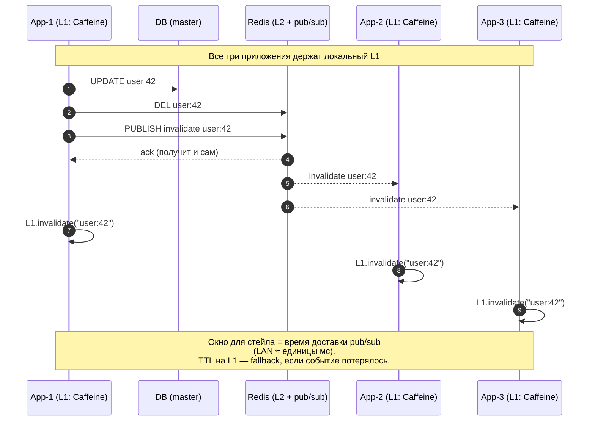

# Distributed Caching

Когда in-process кэша мало (или нужно делиться между инстансами), кэш выносится в отдельный сервис.

> Большой production-кейс: **Memcached at Facebook**. К 2013 году у FB было >800 серверов Memcached на сотнях ТБ кэша, обслуживающих миллиарды запросов в секунду. Их статья [«Scaling Memcached at Facebook»](https://www.usenix.org/system/files/conference/nsdi13/nsdi13-final170_update.pdf) (NSDI '13) — учебник по distributed caching: lease-based stale prevention, regional pools, gutter (mini-pool на случай smоки master), thundering herd mitigation. Если тема серьёзно интересна — это must-read.

## Топологии

### 1. Centralized (Redis / Memcached)

Один узел (или кластер) хранит данные. Все клиенты ходят туда.

```
[app1] ─┐
[app2] ─┼─→ [Redis]
[app3] ─┘
```

**Плюсы:** один источник истины для кэша; добавление инстансов не дублирует данные.
**Минусы:** сетевая latency (~0.5–2ms LAN); масштабирование узла = шардирование (см. ниже).

### 2. Replicated (Hazelcast, Infinispan, Apache Ignite)

Каждый узел хранит **копию** данных. Записи синхронизируются по cluster bus (gossip/IGMP).

```
[app1+cache1] ←sync→ [app2+cache2] ←sync→ [app3+cache3]
```

**Плюсы:** чтение локально (~ns); нет network round-trip.
**Минусы:** объём данных ограничен RAM **одного** узла; запись N×expensive (рассылка); сложная консистентность при сетевых разбиениях.

Подходит для небольших датасетов с heavy reads (конфигурация, справочники).

### 3. Near-cache (L1 + L2 hybrid)

Каждое приложение держит небольшой локальный L1 (Caffeine) + общий L2 (Redis).

```
[app1+L1] ─┐
[app2+L1] ─┼─→ [Redis L2]
[app3+L1] ─┘
```

Read: L1 → L2 → DB. Write: invalidate L1 + write L2.

**Плюсы:** локальные ns-чтения для горячих + большой shared объём.
**Минусы:** **кросс-нодовая инвалидация** (см. ниже) — главная сложность.

### 4. Sidecar / per-pod

В Kubernetes — Redis (или dragonfly, KeyDB) как sidecar в pod'е. Latency ~ pod-internal (микросекунды), но шаринг между pod'ами теряется.

Используется редко, в специфичных случаях (tier-1 hot path).

---

## Когда какую топологию выбрать

| Сценарий | Топология | Почему |
|----------|-----------|--------|
| Read-heavy, dataset > RAM узла, нужен shared state между N инстансами | **Centralized (Redis Cluster)** | Один источник истины, шардинг встроенный |
| Read-very-heavy (>10× write), малый dataset (<RAM), latency критична | **Near-cache (Caffeine L1 + Redis L2)** | 90% запросов — локальные ns; 10% — LAN |
| Малый shared dataset (конфигурация, feature flags) | **Replicated (Hazelcast/Ignite)** | Чтения локальные, записи редкие |
| Микросервис без зависимостей от соседей, эфемерные данные | **Sidecar (per-pod Redis)** | Изоляция; нет cross-pod state |
| Шардирование данных приложением (Memcached в стиле FB) | **Centralized + client-side consistent hashing** | Простой Memcached/Redis-узлы без cluster mode |

---

## Sharding

### Server-side sharding (Redis Cluster)

Сам кэш-кластер распределяет ключи по узлам (16384 slots). Клиент видит логически один кэш.

См. [REDIS.md](REDIS.md).

### Client-side sharding (consistent hashing)

Клиент сам решает, в какой узел писать. Memcached традиционно так работает.

**Naive `hash(key) % N`:** добавление узла → почти все ключи переезжают.

**Consistent hashing:**
1. Узлы и ключи мапятся на круг хешей \[0, 2^32).
2. Ключ принадлежит первому узлу по часовой стрелке.
3. Добавление узла перемещает только 1/N ключей (свой сегмент).
4. **Virtual nodes (vnodes):** каждый физический узел = M точек на круге → лучшая балансировка + плавная миграция.

**Минимизация перемещения данных:**
- N узлов, добавляем 1 → переезжает ~1/(N+1) ключей.
- vs naive `% N` → ~N/(N+1) ключей переезжает.

См. Ex10 для реализации.

Оригинальная статья: Karger, Lehman, Leighton, Levine, Lewin & Panigrahy, [«Consistent Hashing and Random Trees»](https://www.cs.princeton.edu/courses/archive/fall09/cos518/papers/chash.pdf), STOC '97.

### Rendezvous hashing (HRW)

Альтернатива consistent hashing. Для каждого ключа считается `score = hash(key, node)` для всех узлов; выигрывает максимальный. Преимущество: нет vnode-сложности, и при удалении узла перераспределение идеально равномерное.

Используется в CDN edge selection, некоторых gossip-протоколах. См. [Wikipedia: Rendezvous hashing](https://en.wikipedia.org/wiki/Rendezvous_hashing).

### Jump Consistent Hash (Google, 2014)

Минималистичная альтернатива на ~10 строк кода: возвращает `bucket(key, num_buckets)` без хранения ring'а в памяти. При увеличении числа узлов ровно `1/N` ключей переезжают на новый узел. Подходит, когда узлы нумеруются 0..N-1 и не удаляются произвольно.

Статья: Lamping & Veach, [«A Fast, Minimal Memory, Consistent Hash Algorithm»](https://arxiv.org/abs/1406.2294), 2014.

---

## Cross-node invalidation (для near-cache)

L1 у инстансов разный; при `db.update()` нужно инвалидировать L1 на ВСЕХ инстансах. Иначе один читает свежее, другой — стейл.

**Подходы:**
1. **Pub/sub в Redis (или Kafka):** на write публикуется `invalidate user:42`, все подписаны → удаляют локально. Простой, но — async, между публикацией и приёмом окно для стейла.
2. **TTL на L1:** оставить L1 со коротким TTL (секунды). Стейл ограничен TTL'ом.
3. **CDC (change data capture):** Debezium читает binlog БД → публикует events → инвалидация. Не требует кода в `db.update()`.
4. **Versioned keys (`user:42:v3`):** на write увеличиваем версию (atomic counter в Redis). На read берём текущую версию + ключ. Старые версии eventually evict-нутся. Дороже по запросам (две: get version, then get value), но без межинстансной синхронизации.
5. **Hazelcast/Apache Ignite встроенно** — у них есть near-cache с автоматической invalidation через cluster bus.

Для Redis-based стэка (наиболее частый) — обычно **pub/sub + TTL fallback**.



---

## Multi-tier read flow (L1 → L2 → DB)

```
fun get(key: K): V? {
    return l1.get(key)
        ?: l2.get(key)?.also { l1.put(key, it) }
        ?: db.load(key)?.also { l2.put(key, it); l1.put(key, it) }
}
```

Подводные камни:
- **Stampede на L2:** если L1 промахивается, и сотни инстансов одновременно читают — L2 не нагрузится (это его задача), но БД может. Защита — single-flight на L2 fetch (распределённый mutex в Redis).
- **Negative caching на каждом уровне:** запоминать null'ы, иначе penetration на несуществующий ключ.

---

## CAP и distributed cache

Кэш как distributed system — подвержен CAP. См. [`system-design/theory/distributed_systems.md`](../../system-design/theory/distributed_systems.md).

В Redis Cluster при netsplit:
- **Большая партиция продолжает работать** (есть quorum).
- Малая — теряет write capability (`min-replicas-to-write`).
- На repartition: данные минорной партиции, записанные после split, теряются (AP-приоритет, не CP).

Для cache это обычно ок: источник истины — БД.

---

## Memcached vs Redis

| Аспект | Memcached | Redis |
|--------|-----------|-------|
| Структуры | только string | rich types |
| Persistence | нет | RDB+AOF |
| Replication | нет (sidecar решения) | master-replica |
| Multi-thread | да | single thread (с 6.0 — IO threads) |
| Eviction | LRU | конфигурируемо |
| Memory efficiency | slab allocator (низкая фрагментация) | jemalloc |

Memcached проще, быстрее на чистом get/set с большим параллелизмом, но для современного стэка Redis выигрывает по фичам.

---

## Real-world кейсы

- **Memcached at Facebook (NSDI '13)** — [paper](https://www.usenix.org/system/files/conference/nsdi13/nsdi13-final170_update.pdf). Lease-based stale prevention (выдают lease при miss, чтобы только один client грузил из БД), regional pools, gutter-pool на случай отказа основного узла. Канон distributed caching.
- **Netflix EVCache** ([blog](https://netflixtechblog.com/caching-for-a-global-netflix-7bcc6b9a1db8)) — multi-region Memcached с custom client'ом (`spymemcached`). Каждая копия данных в N AZ для зональной доступности; reads — в локальную AZ, writes — fan-out во все.
- **Discord session fan-out** — переписали Python+Redis на Rust+CRDB, но pattern «локальный shard + global broadcast» остался ([blog: How Discord scaled Elixir to 5M sessions](https://discord.com/blog/how-discord-scaled-elixir-to-5-000-000-concurrent-users)).
- **Twitter timelines** — [Manhattan blog](https://blog.twitter.com/engineering/en_us/a/2014/manhattan-our-real-time-multi-tenant-distributed-database-for-twitter-scale): timeline cache fan-out для celebrity tweet'ов с миллионами follower'ов — частный случай hot-key проблемы (см. [ANTI_PATTERNS.md](ANTI_PATTERNS.md) §5).

---

## Подводные камни

1. **Кэш стал primary store.** Если БД отключаешь и оставляешь Redis — запиши, что персистенс работает (AOF), и backup'ы есть. Иначе сюрприз при restart.
2. **Network partition между app и cache:** обработать таймауты, fallback на DB. Не вешать запросы.
3. **Connection pool to cache:** одна connection на JVM достаточна для Lettuce (multiplexing); для Jedis нужен pool.
4. **Serialization формат:** JDK serial — медленно и хрупко. Используй JSON (Jackson) или binary (Protobuf, Kryo).

## См. также

- Реализации: [REDIS.md](REDIS.md), [CAFFEINE.md](CAFFEINE.md)
- Консистентность → [CONSISTENCY.md](CONSISTENCY.md)
- Distributed systems / CAP → [`system-design/theory/distributed_systems.md`](../../system-design/theory/distributed_systems.md)

## Источники

**Papers:**
- Karger et al., [«Consistent Hashing and Random Trees»](https://www.cs.princeton.edu/courses/archive/fall09/cos518/papers/chash.pdf), STOC '97 — оригинальный consistent hashing.
- Lamping & Veach, [«A Fast, Minimal Memory, Consistent Hash Algorithm»](https://arxiv.org/abs/1406.2294), 2014 — Jump Hash от Google.
- Nishtala et al., [«Scaling Memcached at Facebook»](https://www.usenix.org/system/files/conference/nsdi13/nsdi13-final170_update.pdf), NSDI '13.

**Engineering blogs:**
- [Netflix EVCache: caching for a global Netflix](https://netflixtechblog.com/caching-for-a-global-netflix-7bcc457012f1)
- [Discord: how we scaled Elixir to 5M concurrent users](https://discord.com/blog/how-discord-scaled-elixir-to-5-000-000-concurrent-users)
- [Twitter Manhattan blog](https://blog.twitter.com/engineering/en_us/a/2014/manhattan-our-real-time-multi-tenant-distributed-database-for-twitter-scale)

**Docs:**
- [Hazelcast IMDG documentation](https://docs.hazelcast.com/imdg/latest/)
- [Apache Ignite documentation](https://ignite.apache.org/docs/latest/)
- [Redis Cluster Specification](https://redis.io/docs/reference/cluster-spec/)

**Wikipedia:**
- [Rendezvous hashing (HRW)](https://en.wikipedia.org/wiki/Rendezvous_hashing)
- [Consistent hashing](https://en.wikipedia.org/wiki/Consistent_hashing)
