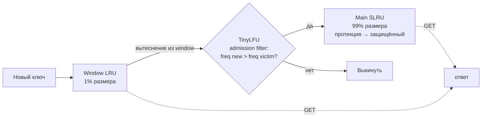

# Eviction Policies

Когда кэш достигает лимита (по числу записей или по weight), нужно выбрать жертву. Алгоритм выбора = eviction policy.

> Хорошая интуиция: на интервью 90% времени вас спросят про **LRU** (классика, легко запрограммировать с двусвязным списком + HashMap) и **W-TinyLFU** (то, что использует Caffeine — современный default). Зная их, остальные алгоритмы — это вариации, и про них спрашивают, чтобы проверить «понимаете ли trade-off».

## Базовые алгоритмы

### LRU (Least Recently Used)
Выбрасывает запись с самым старым **последним обращением**.

**Реализация O(1):** двусвязный список + HashMap. На `get`/`put` — переместить в head. Жертва — tail.

**Плюсы:** прост, хорош для temporal locality.

**Минусы:**
- **Scan-resistance отсутствует:** один большой обход редко-используемых ключей выбьет все горячие. Классический пример — backup-скрипт читает все строки таблицы один раз → весь buffer pool заполняется ими, OLTP-транзакции теряют hit-ratio. Этот баг в InnoDB исправлен «midpoint insertion strategy» — новые страницы вставляются не в head, а на 5/8 списка ([MySQL: Buffer Pool LRU Algorithm](https://dev.mysql.com/doc/refman/8.0/en/innodb-buffer-pool.html#innodb-buffer-pool-lru)).
- На concurrent доступе нужны локи (CAS на двусвязном списке нетривиален). В Caffeine — амортизированный безлоковый подход через batched ring buffer (см. [BP-Wrapper paper](https://www.cse.ohio-state.edu/hpcs/WWW/HTML/publications/papers/TR-09-1.pdf)).

### LFU (Least Frequently Used)
Выбрасывает запись с **наименьшей частотой** обращений.

**Реализация:** счётчик на ключ + sorted-by-frequency структура. O(1) реализация — частотные buckets (см. Ex03).

**Плюсы:** scan-resistance (один проход не накопит частоту).

**Минусы:**
- **Старение:** ключ-ветеран с frequency=10000 будет жить вечно, даже если перестал быть актуальным. Нужен decay/aging.
- Дороже LRU по памяти (счётчик на каждый ключ).

### FIFO
Выбрасывает первое вставленное. Простейшая очередь.

**Плюсы:** просто.
**Минусы:** игнорирует частоту обращений → плохой hit ratio.

### Random
Выбрасывает случайный ключ.

**Плюсы:** O(1), thread-friendly (нет общей структуры порядка).
**Минусы:** worst-case на любых паттернах. Иногда используется в Memcached/Redis (`allkeys-random`) когда есть ресурсы и не хочется мудрить.

---

## Продвинутые алгоритмы

### ARC (Adaptive Replacement Cache)
Запатентован IBM (срок патента истёк). Поддерживает **2 LRU списка**: T1 (recently used once) и T2 (recently used multiple times) + ghost lists B1/B2 (вытесненные). Адаптивно балансирует размер T1 vs T2 в зависимости от паттерна.

Используется в ZFS, PostgreSQL (вариация — **clock-sweep** с 2-bit usage counter; см. [`src/backend/storage/buffer/freelist.c`](https://github.com/postgres/postgres/blob/master/src/backend/storage/buffer/freelist.c)).

Оригинальная статья: Megiddo & Modha, [«ARC: a self-tuning, low-overhead replacement cache»](https://www.usenix.org/legacy/publications/library/proceedings/fast03/tech/full_papers/megiddo/megiddo.pdf), USENIX FAST '03.

### 2Q
Похож на ARC: A1 (FIFO для новичков) + Am (LRU для прижившихся). На повторное обращение запись переезжает из A1 в Am. Защищает от scan'ов.

Оригинальная статья: Johnson & Shasha, [«2Q: A Low Overhead High Performance Buffer Management Replacement Algorithm»](https://www.vldb.org/conf/1994/P439.PDF), VLDB '94.

### TinyLFU
Eviction строится на **admission filter**: новый ключ примет, только если его сэмплированная частота больше, чем у потенциальной жертвы. Частота хранится в **Count-Min Sketch** (вероятностная структура, O(1) с фиксированной ошибкой).

**Count-Min Sketch — мини-объяснение:**
```
counters[d][w] — матрица d строк × w колонок (типично d=4, w=размер_кэша × 8)
hash_i(key)   — d независимых hash-функций → каждая указывает на ячейку в i-й строке

increment(k): for i in 0..d-1: counters[i][hash_i(k) % w] += 1
estimate(k):  return min(counters[i][hash_i(k) % w] for i in 0..d-1)
```
Минимум по d гарантирует, что счётчик не завышен (overcount возможен из-за коллизий — но никогда undercount). Память: ~4 × cache_size × 8 × 4 бита ≈ десятки KB на 100k ключей.

**Aging:** периодический halving (`counter >>= 1`) каждые N инкрементов → решает проблему "ветеранов" в LFU. Без aging счётчик старого популярного ключа застрял бы на максимуме навсегда.

Оригинальная статья: Einziger, Friedman, Manes, [«TinyLFU: A Highly Efficient Cache Admission Policy»](https://arxiv.org/abs/1512.00727), ACM Transactions on Storage 2017.

### W-TinyLFU (Caffeine)
**TinyLFU + window LRU:**
- Window (1% размера) — LRU для свежих записей.
- Main (99%) — SLRU (Segmented LRU) с TinyLFU admission.
- Из window вытесняемая запись пытается попасть в main; admission filter решает, заслуживает ли она.



Результат: **scan-resistance** (одноразовые ключи отсеиваются admission filter'ом) + **frequency bias** (часто читаемые остаются) + **aging** (ветераны подвергаются halving) + **O(1) операции**.

**Числа:** на наборах SPC, ARC, Twitter Memcached W-TinyLFU стабильно даёт **+5–15% hit-ratio** vs LRU при том же размере, а в exemplar-нагрузках с heavy-tail распределением — **до +25%** ([Caffeine Efficiency wiki](https://github.com/ben-manes/caffeine/wiki/Efficiency)). На размерах кэша порядка миллионов ключей это означает **в 2–5 раз меньше промахов** — прямой выигрыш по latency и по нагрузке на источник.

Это default в Caffeine. Подробнее → [CAFFEINE.md](CAFFEINE.md).

Доклад от автора: Ben Manes, [«Design of a Modern Cache», Strange Loop 2017](https://www.youtube.com/watch?v=Hk0VJFKGmH0).

---

## TTL vs TTI

- **TTL (time to live) / expireAfterWrite:** запись expires через t после ПЕРВОЙ записи.
- **TTI (time to idle) / expireAfterAccess:** запись expires через t после ПОСЛЕДНЕГО обращения (read или write).

```
expireAfterWrite(10m):   put(t=0) ... read(t=9m) ... read(t=11m) → MISS (expired при t=10m)
expireAfterAccess(10m):  put(t=0) ... read(t=9m) ... read(t=18m) → HIT  (read обновил access)
                                                       read(t=29m) → HIT
                                                                     ...
                                                                     (живёт пока его трогают)
```

TTL проще для ограничения stale (хочу свежесть не старше N). TTI — для классического "evict idle".

Можно комбинировать: `expireAfterWrite=1h && expireAfterAccess=10m` — "максимум 1 час, но если 10 минут не трогают — выкидываем раньше".

## Custom expire

Caffeine `expireAfter(Expiry<K, V>)` — TTL зависит от ключа/значения (например, премиум-юзеры дольше живут в кэше).

## Size-based vs weight-based

- **`maximumSize(N)`:** ограничение по числу записей. Подходит, когда записи примерно равны.
- **`maximumWeight(W) + weigher((k, v) -> v.size)`:** ограничение по сумме весов. Нужно, если значения сильно разные (HTML-страницы 1KB и 1MB в одном кэше).

## Manual invalidation

Кроме автоматического eviction, любой кэш поддерживает явную инвалидацию:
- `cache.invalidate(key)` — удалить один.
- `cache.invalidateAll(keys)` / `invalidateAll()` — pre-bulk.

Часто триггерится после `db.update()` (см. [CACHE_PATTERNS.md](CACHE_PATTERNS.md)).

## Reference: Redis maxmemory-policy

Redis отдельно — у него свои названия:
- `noeviction` — fail на write при OOM.
- `allkeys-lru` / `allkeys-lfu` / `allkeys-random` — evict из всех ключей.
- `volatile-lru` / `volatile-lfu` / `volatile-random` / `volatile-ttl` — evict только из ключей с TTL.

Для cache-only Redis: `allkeys-lfu`. Подробнее → [REDIS.md](REDIS.md). Оф. документация: [Redis: key eviction](https://redis.io/docs/reference/eviction/).

**Важно:** Redis LRU/LFU — **аппроксимированные** (sample-based). Точно отслеживать LRU dlinked-list на каждом ключе слишком дорого. Параметр `maxmemory-samples` (default 5) определяет, сколько случайных ключей сэмплируется при выборе жертвы; больше = ближе к идеальному LRU/LFU, но дороже CPU. На уровне 10 — практически неотличимо от точного.

## Когда какой алгоритм выбрать

| Паттерн доступа | Лучший выбор | Почему |
|------------------|--------------|--------|
| Recency-driven (последние действия пользователя) | LRU | Идеален для temporal locality |
| Frequency-driven (популярные товары, профили celebrity) | LFU / W-TinyLFU | Не теряет «зомби-горячие» ключи на коротком всплеске трафика |
| Mixed + scan resistance | W-TinyLFU | Объединяет recency window и frequency main |
| Большие записи разного веса | LRU + `weigher` | Ограничение по сумме байт |
| Append-only / неактуальное прошлое | FIFO | Дёшево, простая аналитика |
| Без памяти под счётчики (embedded, edge) | Random | O(1), без структуры |

## Источники

**Papers:**
- Megiddo & Modha, [«ARC: a self-tuning, low-overhead replacement cache»](https://www.usenix.org/legacy/publications/library/proceedings/fast03/tech/full_papers/megiddo/megiddo.pdf), USENIX FAST '03.
- Johnson & Shasha, [«2Q»](https://www.vldb.org/conf/1994/P439.PDF), VLDB '94.
- Einziger, Friedman, Manes, [«TinyLFU: A Highly Efficient Cache Admission Policy»](https://arxiv.org/abs/1512.00727), 2017.
- Cormode & Muthukrishnan, [«An Improved Data Stream Summary: The Count-Min Sketch and its Applications»](http://dimacs.rutgers.edu/~graham/pubs/papers/cm-full.pdf) — основа TinyLFU.

**Docs / wiki:**
- [Caffeine: Efficiency benchmarks](https://github.com/ben-manes/caffeine/wiki/Efficiency)
- [Redis: key eviction policies](https://redis.io/docs/reference/eviction/)
- [MySQL: Buffer Pool LRU Algorithm](https://dev.mysql.com/doc/refman/8.0/en/innodb-buffer-pool.html#innodb-buffer-pool-lru)

**Talks:**
- Ben Manes, [«Design of a Modern Cache», Strange Loop 2017](https://www.youtube.com/watch?v=Hk0VJFKGmH0).
