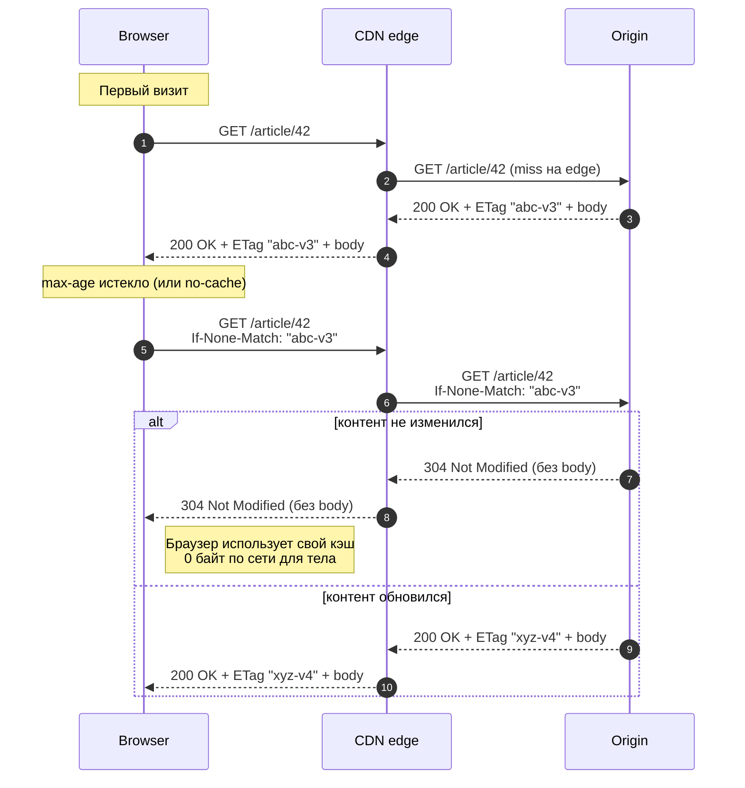

# HTTP & CDN Caching

HTTP — самый старый и самый стандартизованный кэширующий протокол. Управляется заголовками; работает на трёх уровнях: browser → CDN edge → origin.

> Канонический источник правды — [RFC 9111 (HTTP Caching, 2022)](https://datatracker.ietf.org/doc/html/rfc9111), который заменил [RFC 7234](https://datatracker.ietf.org/doc/html/rfc7234) (2014). Если в реальной жизни «не понятно как должен вести себя кэш» — открываем RFC. Для разработчика дружелюбнее и иллюстративнее [MDN: HTTP Caching](https://developer.mozilla.org/en-US/docs/Web/HTTP/Caching) и [web.dev: HTTP cache](https://web.dev/articles/http-cache).

База по HTTP — [`system-design/theory/http_networking.md`](../../system-design/theory/http_networking.md).

## `Cache-Control` (RFC 7234 / 9111)

Самый главный заголовок. Запрос/ответ.

### Директивы ответа

| Директива | Семантика |
|-----------|-----------|
| `max-age=<s>` | Свежесть N секунд. Обязательная. |
| `s-maxage=<s>` | Как `max-age`, но **только для shared caches** (CDN, прокси). Перебивает `max-age`. |
| `public` | Можно кэшировать **shared** caches (CDN). |
| `private` | Только в **private** cache (браузер юзера). Не клади в CDN. |
| `no-cache` | **Обязан** revalidate (через `If-None-Match`/`If-Modified-Since`) перед использованием. **НЕ значит "не кэшировать"**. |
| `no-store` | Вообще не кэшировать (ни диск, ни память). Для чувствительного. |
| `must-revalidate` | После `max-age` обязан revalidate. Обычно подразумевается, но строгое поведение запрещает stale-on-error. |
| `immutable` | Контент НИКОГДА не изменится. Браузер не делает revalidate в `max-age`. Идеал для versioned URLs. |
| `stale-while-revalidate=<s>` | После `max-age` отдавать stale + async revalidate в течение N секунд. |
| `stale-if-error=<s>` | При ошибке origin — отдавать stale в течение N секунд. |

### Директивы запроса

| Директива | Семантика |
|-----------|-----------|
| `no-cache` | Заставить revalidate (Ctrl+F5 в браузере) |
| `no-store` | Заставить не кэшировать |
| `max-age=0` | "Свежее, чем 0s" → revalidate |
| `only-if-cached` | Не ходить в сеть, если miss — 504 |

### Типичные комбинации

```
Cache-Control: no-store
```
Чувствительное (банковские балансы, токены).

```
Cache-Control: max-age=0, no-cache
```
HTML страница с динамикой — заставить revalidate каждый раз (ETag решит, передавать ли тело).

```
Cache-Control: public, max-age=31536000, immutable
```
Versioned static asset (`/app.abc123.js`) — год в кэше без revalidate.

```
Cache-Control: public, max-age=60, s-maxage=600, stale-while-revalidate=86400
```
API-эндпоинт: браузер 1 минута, CDN 10 минут; на CDN после 10 минут — stale в течение суток + async refresh.

---

## Validators: ETag и Last-Modified

Заголовки **на ответ** дают валидаторы; клиент шлёт их назад на следующем запросе.

### ETag / If-None-Match

```
GET /article/42
←  200 OK
   ETag: "abc-v3"
   Body: ...

GET /article/42
   If-None-Match: "abc-v3"
←  304 Not Modified
   (без body)
```



**Strong ETag (`"abc"`):** точное совпадение байт ответа.
**Weak ETag (`W/"abc"`):** семантическое равенство (например, разные форматы пробелов считаются равными).

ETag можно генерить как:
- хеш контента (`SHA1(body)`)
- версия из БД (`row.version`)
- timestamp (но тогда лучше `Last-Modified`)

### Last-Modified / If-Modified-Since

```
GET /article/42
←  200 OK
   Last-Modified: Wed, 06 May 2026 10:00:00 GMT

GET /article/42
   If-Modified-Since: Wed, 06 May 2026 10:00:00 GMT
←  304 Not Modified
```

Гранулярность 1 секунда. Уязвим к clock skew.

### Strong vs Weak validation для `If-Match` (PUT)

```
PUT /article/42
   If-Match: "abc-v3"
   Body: ...
```

Optimistic locking. Если ETag не совпал → `412 Precondition Failed`. ETag — **strong** обязателен для PUT (W/ нельзя).

---

## `Vary`

Сообщает кэшу, что ответ зависит от значений других заголовков:

```
Cache-Control: public, max-age=60
Vary: Accept-Encoding, Accept-Language
```

CDN/браузер хранит отдельные копии для разных значений `Accept-Encoding` (gzip vs br) и `Accept-Language` (en vs ru).

**Грабли:** `Vary: User-Agent` или `Vary: Cookie` → cardinality взрывается, hit-ratio падает в ноль. Никогда не делать `Vary: Cookie` для статики.

---

## CDN

CDN = распределённая сеть edge-серверов с кэшем перед origin'ом.

### Pull vs Push

- **Pull:** edge не знает контент заранее; на первый miss идёт к origin, кэширует локально. Дефолт (Cloudflare, Fastly, CloudFront).
- **Push:** контент заливается на edge заранее (через API). Подходит для крупных файлов, гарантированных hits.

### Invalidation

1. **Versioned URLs:** вместо `/app.js` → `/app.abc123.js`. На deploy меняется хеш → новый URL → instant rollout. Старые версии живут в кэше до eviction. **Default для статики.**
2. **Purge API:** удалить ресурс из всех edge'ей. Минуты задержки распространения; иногда деньги; не всегда атомарно.
3. **Soft purge** (Fastly, Cloudflare Workers): помечает stale, не удаляет — следующий запрос принесёт revalidate, а пока висит — stale-while-revalidate.

Default стратегия: **versioned URLs для всего, что меняется при deploy**. Purge — только для контента, который **должен** исчезнуть (legal removal).

#### Стратегии versioning'а ассетов

| Стратегия | Пример | Плюсы | Минусы |
|-----------|--------|-------|--------|
| Hash в pathname | `/static/app.abc123.js` | Кэшируется навсегда (`immutable`), смена версии = новый URL | Требует пересборки HTML/manifest на каждом deploy |
| Hash в query | `/static/app.js?v=abc123` | HTML простой, путь стабилен | Некоторые прокси игнорируют query → коллизии |
| Asset manifest | `/manifest.json` → `app.js: "abc123"` | Гибко: SPA сам резолвит | Нужно загрузить manifest перед основным asset'ом |
| `Cache-Tag` (Fastly/Cloudflare) | header `Cache-Tag: product-42` | Group purge без знания path | Нужна поддержка CDN |

Webpack/Vite по умолчанию делают **hash в pathname** + `Cache-Control: max-age=31536000, immutable`. Это «золотой стандарт» для статики SPA.

#### `Cache-Tag` (surrogate-key)

Расширение от CDN-вендоров: указать в ответе один или несколько тегов; potом через purge API сбросить ВСЕ ответы с заданным тегом. Подходит, когда «продукт 42 обновился» → нужно сбросить главную, поиск, страницу категории.

```
HTTP/1.1 200 OK
Surrogate-Key: product-42 category-laptops homepage
```
Документация: [Fastly: surrogate keys](https://www.fastly.com/documentation/reference/http/http-headers/Surrogate-Key/), [Cloudflare: cache tags](https://developers.cloudflare.com/cache/how-to/purge-cache/purge-by-tags/) (Enterprise).

### Cache key

Edge кэширует по `(method, host, path, query, Vary headers)`. Удалить из ключа что не нужно (например, рекламные параметры `?utm_source=...`) — настройка в CDN.

### Surrogate-Control

Альтернатива `Cache-Control` только для CDN (origin шлёт CDN'у; CDN не передаёт клиенту). Используется в Fastly/Akamai для разделения "cache в CDN на 1 час, но клиент не должен кэшировать".

---

## Service Worker / Browser-side

Service Worker может перехватывать `fetch` в браузере и реализовывать произвольные стратегии:
- **cache-first:** сначала кэш, fallback в сеть.
- **network-first:** сначала сеть, fallback в кэш (offline).
- **stale-while-revalidate:** отдать кэш + обновить в фоне.

Полезно для PWA / offline-first.

Производственный стандарт — [Workbox](https://developer.chrome.com/docs/workbox) (от Google). Минимальный пример:

```javascript
import { registerRoute } from 'workbox-routing';
import { StaleWhileRevalidate, CacheFirst } from 'workbox-strategies';

// API: отдаём кэш мгновенно, обновляем в фоне
registerRoute(
  ({ url }) => url.pathname.startsWith('/api/'),
  new StaleWhileRevalidate({ cacheName: 'api-cache' }),
);

// Статика: вечный кэш с hash-versioning
registerRoute(
  ({ request }) => request.destination === 'script' || request.destination === 'style',
  new CacheFirst({ cacheName: 'assets' }),
);
```

---

## Грабли

1. **`no-cache` ≠ `no-store`.** `no-cache` РАЗРЕШАЕТ кэшировать, требует revalidate. `no-store` запрещает.
2. **Куки + кэширование:** если `Cache-Control: private` забыт, CDN может закэшировать ответ с set-cookie от одного юзера и отдать другому. **Default'но включи `private` или `no-store` для аутентифицированных ответов.**
3. **GET vs POST:** POST по умолчанию не кэшируется. Для idempotent читалки используй GET (или `Cache-Control: max-age` на POST с явной поддержкой кэшем — реализуется редко).
4. **CORS preflight (`OPTIONS`)** кэшируется отдельно через `Access-Control-Max-Age`.
5. **`Vary` забыт:** разные пользователи получают чужой gzip/non-gzip → "битые" картинки.
6. **Огромный ETag:** weak ETag из 8 байт лучше strong из 64. Большие ETag увеличивают header size.

## Real-world кейсы

- **Cloudflare** обслуживает ~20% всего веба и кэширует статику миллионам сайтов. Их подход «edge-first» — при miss идти в origin как можно реже; `stale-while-revalidate` + `stale-if-error` включён по умолчанию для большинства тарифов ([Cloudflare cache docs](https://developers.cloudflare.com/cache/concepts/cache-control/)).
- **Vercel ISR (Incremental Static Regeneration).** Статика рендерится при сборке + регенерируется при запросе по `revalidate: N` секунд. Internally: `s-maxage` + `stale-while-revalidate` + версионирование по deploy ID. ([Vercel docs: ISR](https://vercel.com/docs/incremental-static-regeneration)).
- **Wikipedia/Wikimedia** — Varnish + Apache TS перед origin'ом. Для авторизованных юзеров — `Cache-Control: private`; для анонимных (90% трафика) — long-cached версии. Purge по теме статьи (surrogate keys) при правке.
- **GitHub raw.githubusercontent.com** — `Cache-Control: max-age=300` + `ETag` от commit hash. Простая стратегия для immutable-by-commit контента.

## См. также

- HTTP базовые → [`system-design/theory/http_networking.md`](../../system-design/theory/http_networking.md)
- ETag упражнение → Ex09
- Anti-patterns → [ANTI_PATTERNS.md](ANTI_PATTERNS.md)

## Источники

**RFC / canonical specs:**
- [RFC 9111 — HTTP Caching (2022)](https://datatracker.ietf.org/doc/html/rfc9111) — основной канонический стандарт
- [RFC 5861 — `stale-while-revalidate` / `stale-if-error`](https://datatracker.ietf.org/doc/html/rfc5861)
- [RFC 7232 — Conditional Requests (`ETag`, `If-Match`, `If-None-Match`)](https://datatracker.ietf.org/doc/html/rfc7232)

**Documentation:**
- [MDN: HTTP Caching](https://developer.mozilla.org/en-US/docs/Web/HTTP/Caching)
- [MDN: Cache-Control](https://developer.mozilla.org/en-US/docs/Web/HTTP/Headers/Cache-Control)
- [web.dev: HTTP cache](https://web.dev/articles/http-cache)
- [Cloudflare: Cache rules](https://developers.cloudflare.com/cache/how-to/cache-rules/)
- [Fastly: Surrogate-Key](https://www.fastly.com/documentation/reference/http/http-headers/Surrogate-Key/)
- [Workbox (Google PWA library)](https://developer.chrome.com/docs/workbox)
- [Vercel: Incremental Static Regeneration](https://vercel.com/docs/incremental-static-regeneration)

**Engineering posts:**
- [Jake Archibald: Caching best practices & max-age gotchas](https://jakearchibald.com/2016/caching-best-practices/) — must-read для понимания pitfalls.
- [Harry Roberts: Cache-Control for civilians](https://csswizardry.com/2019/03/cache-control-for-civilians/)
