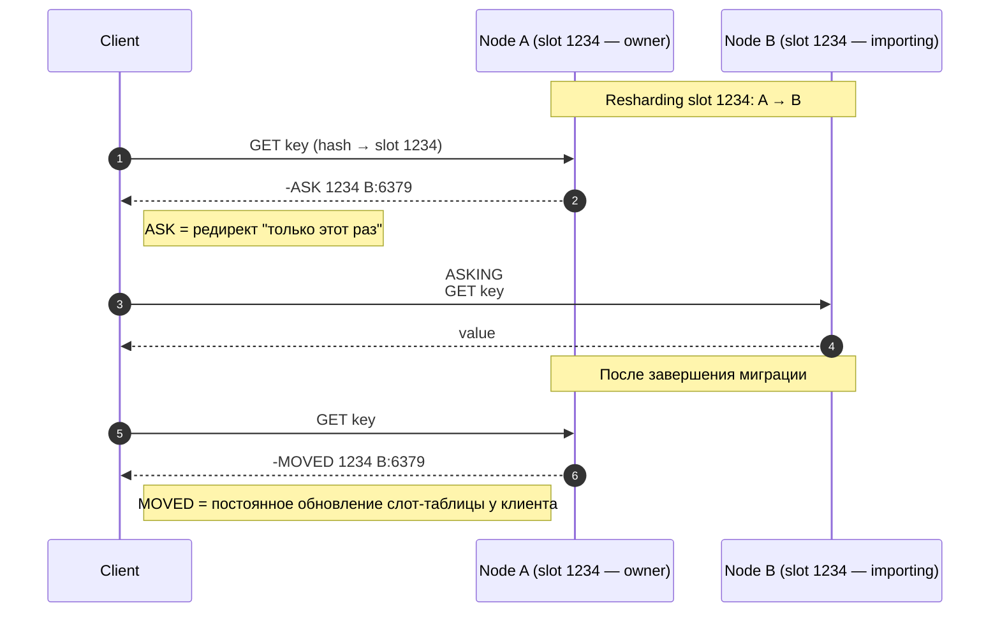

# Redis

In-memory key-value store. Используется как distributed cache, primary store для эфемерных данных, message broker (Streams/Pub-Sub), session store, rate-limiter и т.д.

Ключевая особенность: **single-threaded command processing** (для основного потока). Это упрощает модель — нет race condition между командами на сервере, но одна тяжёлая команда блокирует всё.

> Антирез ([Salvatore Sanfilippo, автор Redis](http://antirez.com/)) специально выбрал single-threaded модель: «лучше один быстрый поток, чем синхронизация многих». Это даёт ~100k ops/s на одном core при микросекундной latency — для 99% нагрузок этого хватает. С 6.0 IO-операции (parsing, output) выведены в IO threads, но **выполнение команд** по-прежнему single-threaded.

> Альтернативы при нехватке: [KeyDB](https://docs.keydb.dev/) (multi-threaded форк), [Dragonfly](https://www.dragonflydb.io/) (новый wire-compatible сервер на shared-nothing архитектуре, ~25× throughput Redis в синтетике).

## Структуры данных

| Тип | Команды | Применение |
|-----|---------|------------|
| **string** | `SET/GET/INCR/APPEND/SETEX` | счётчики, простые KV, JSON в string |
| **hash** | `HSET/HGET/HGETALL/HMGET` | объекты (user → {name, email}); экономит память vs N strings |
| **list** | `LPUSH/RPUSH/LPOP/LRANGE/BLPOP` | очереди, последние N элементов |
| **set** | `SADD/SREM/SMEMBERS/SINTER/SUNION` | теги, уникальные значения, set ops |
| **sorted set (zset)** | `ZADD/ZRANGE/ZRANGEBYSCORE/ZRANK` | leaderboards, time series, priority queues |
| **stream** | `XADD/XREAD/XGROUP CREATE/XREADGROUP` | event log, message broker (Kafka-like) |
| **hyperloglog** | `PFADD/PFCOUNT` | approximate cardinality (12KB на 2^64 элементов, ~0.81% ошибки) |
| **bitmap** | `SETBIT/GETBIT/BITCOUNT` | флаги, presence (active users by day) |
| **geo** | `GEOADD/GEOSEARCH` | геопространственный поиск (поверх zset) |

### Когда какую структуру

| Use case | Структура | Команды-якорь |
|----------|-----------|---------------|
| Rate limiter (sliding window) | `zset` (score=timestamp) | `ZADD … NX`, `ZREMRANGEBYSCORE`, `ZCARD` |
| Session store | `hash` или `string` (JSON) с TTL | `SET sess:abc {…} EX 3600` |
| Counter (likes, views) | `string INCR` или per-shard `string`+`SUM` | `INCR likes:post:42` |
| Leaderboard top-100 | `zset` | `ZADD`, `ZREVRANGE 0 99 WITHSCORES` |
| Inbox / feed (последние N постов) | `list` (capped), либо `zset` по timestamp | `LPUSH feed:42 …`, `LTRIM feed:42 0 99` |
| Уникальные посетители за день | `hyperloglog` | `PFADD daily:2026-05-08 user_id`, `PFCOUNT …` |
| Распределённый lock | `string SET … NX PX` + Lua-release | `SET lock:order:42 token NX PX 5000` |
| Pub/Sub (broadcast) | `pub/sub` (fire-and-forget) | `PUBLISH channel msg` |
| Durable queue / event log | `stream` | `XADD`, `XGROUP CREATE`, `XREADGROUP`, `XACK` |
| Geo-поиск ближайших точек | `geo` (внутри `zset`) | `GEOADD`, `GEOSEARCH … BYRADIUS` |
| Bitmap presence (DAU/MAU) | `bitmap` | `SETBIT user:active:2026-05-08 user_id 1`, `BITCOUNT` |

> Подробный command reference: [redis.io/commands](https://redis.io/commands/).

## Persistence

**RDB (snapshot):**
- `save 60 1000` — раз в 60s, если ≥1000 ключей изменено.
- `bgsave` — fork → ребёнок пишет `.rdb`, родитель продолжает обслуживать.
- Между snapshot'ами — потеря.
- Restart быстр: один файл, бинарный.

**AOF (Append-Only File):**
- Лог write-команд.
- `appendfsync`:
  - `always` — fsync на каждой команде. Durable, медленно (~100x slower writes).
  - `everysec` (default) — fsync раз в секунду. Потеря ≤ 1s при крэше OS.
  - `no` — fsync на усмотрение OS (через ~30s). Быстро, но недурабельно.
- AOF rewrite (`bgrewriteaof`) сжимает лог: вместо 1000 INCR'ов один `SET key 1000`.
- Restart — replay AOF (медленнее RDB).

**Combo (рекомендуемо для durable):** AOF `everysec` + периодический RDB. RDB используется для backup'ов, AOF — для recovery до последней секунды.

**Pure cache:** persistence не нужен — `--save ""` и `--appendonly no`. Restart с пустым кэшем.

### RDB vs AOF — сравнительная таблица

| Свойство | RDB | AOF (`everysec`) |
|----------|-----|------------------|
| Durability | до часов потеря | ≤ 1 секунда |
| Recovery time | секунды (бинарный snapshot) | минуты–часы (replay команд) |
| Размер файла | компактный (snapshot) | растёт линейно (требует rewrite) |
| Влияние на latency | пик на `bgsave` (fork copy-on-write) | непрерывный fsync overhead |
| Удобство для backup | да (atomic file) | rsync-friendly, но нужно bgrewrite |

Подробнее: [Redis persistence](https://redis.io/docs/management/persistence/).

## Eviction (`maxmemory-policy`)

| Policy | Поведение |
|--------|-----------|
| `noeviction` (default) | Возвращает ошибку на write при OOM |
| `allkeys-lru` | LRU из всех ключей |
| `allkeys-lfu` | LFU (since 4.0) |
| `allkeys-random` | случайный |
| `volatile-lru` | LRU только из ключей с TTL |
| `volatile-lfu` | LFU только из ключей с TTL |
| `volatile-random` | случайный из ключей с TTL |
| `volatile-ttl` | ключ с ближайшим expiry первый |

Для cache-only — `allkeys-lfu`. Если в Redis смешано (cache + persistent данные с `EXPIRE` только на cache-части) — `volatile-lru`. Алгоритмы — **аппроксимированные** (sample-based), не точный LRU/LFU; настраивается `maxmemory-samples` (default 5).

## Replication

- **Master → replica(s):** async по умолчанию.
- На replica: read-only.
- `WAIT n timeout` — синхронное ожидание подтверждения от n реплик.
- `min-replicas-to-write` — отказ master'а писать, если меньше N реплик online.

## Sentinel

Высокая доступность для **standalone** Redis (не Cluster):
- 3+ Sentinel-узлов мониторят master'а.
- При обнаружении отказа — quorum-based выборы → promote replica.
- Клиент опрашивает Sentinel для актуального master endpoint'а.

Подходит, когда нужен HA без шардинга.

## Cluster

Шардирование + HA:
- **16384 hash slot'ов**, распределённых между master-узлами.
- `slot = CRC16(key) % 16384`.
- Каждый master имеет N replica.
- При запросе в "не свой" slot — `MOVED` (постоянное перенаправление) или `ASK` (временное, во время resharding).
- **Hash tags:** `{user:42}:profile` и `{user:42}:settings` гарантированно лягут в один slot (хешируется только `user:42`) → можно делать multi-key операции и transactions.
- **Multi-key команды** (`MGET`, `MSET`, transactions) **работают только если все ключи в одном slot**.

Resharding — миграция slot'ов между узлами, идёт онлайн (с `MOVED`/`ASK`).



Спецификация: [Redis Cluster Specification](https://redis.io/docs/reference/cluster-spec/).

## Pub/Sub

```
PUBLISH channel msg
SUBSCRIBE channel
PSUBSCRIBE pattern.*
```

**Fire-and-forget:** если подписчика нет — сообщение теряется. Для durable — Streams.

В Cluster: pub/sub по умолчанию работает на всех узлах (рассылка через cluster bus). С 7.0 — sharded pub/sub (`SPUBLISH`/`SSUBSCRIBE`) для масштаба.

## Streams (краткий обзор)

`XADD stream * field value` — append.
`XREAD COUNT 100 STREAMS stream $` — tail-read.
`XGROUP CREATE stream grp $` + `XREADGROUP GROUP grp consumer ...` — consumer groups (Kafka-like).

**Полный pipeline consumer group:**
```bash
# Producer
XADD orders * order_id 42 amount 100

# Consumer A (на старте)
XGROUP CREATE orders processors $ MKSTREAM
XREADGROUP GROUP processors worker-1 COUNT 10 BLOCK 5000 STREAMS orders >
  → [order_id 42 amount 100]
# обработали → ACK
XACK orders processors 1715001234-0

# Если consumer упал, не сделав XACK — сообщение остаётся в Pending Entries List (PEL)
XPENDING orders processors                      # узнать что зависло
XCLAIM orders processors worker-2 60000 1715001234-0   # перенести в worker-2
```

Семантика — at-least-once (как у Kafka): `XACK` обязателен после успешной обработки, иначе при рестарте сообщение придёт повторно. Подробнее: [Redis Streams introduction](https://redis.io/docs/latest/develop/data-types/streams/) и Kafka-аналогии в [`system-design/theory/kafka.md`](../../system-design/theory/kafka.md).

## Транзакции и Lua

**MULTI/EXEC:**
```
MULTI
INCR counter
HSET user:1 name Bob
EXEC
```
Команды копятся в буфер и применяются атомарно. **Без rollback** при ошибке выполнения (только синтаксис проверяется).

**WATCH** — optimistic locking: если ключ изменился между `WATCH` и `EXEC`, транзакция отменяется.

**Lua scripts (`EVAL`/`EVALSHA`):** атомарны (single-threaded → блокируют сервер на время выполнения). Подходят для compare-and-set, rate limiters, idempotent ops. **Не делай длинные циклов в Lua** — заблокируешь весь Redis.

**Пример — atomic versioned key write:**
```lua
-- KEYS[1] = "user:42"
-- KEYS[2] = "user:42:version"
-- ARGV[1] = expected version
-- ARGV[2] = new value
-- ARGV[3] = new TTL (sec)
local current = tonumber(redis.call('GET', KEYS[2]) or '0')
if current ~= tonumber(ARGV[1]) then
  return {err = 'CONFLICT', current = current}
end
redis.call('SET', KEYS[1], ARGV[2], 'EX', ARGV[3])
redis.call('INCR', KEYS[2])
return 'OK'
```
Вызывается `EVALSHA <sha> 2 user:42 user:42:version 7 "{new payload}" 600`. Атомарно, без race между чтением версии и записью.

## Pipelining

Клиент шлёт N команд без ожидания ответов, потом читает N ответов. RTT уменьшается с N×RTT до ~1×RTT. Lettuce/Jedis — поддерживают.

Не путать с транзакциями: pipelining не атомарен.

## Lettuce vs Jedis

| Аспект | Lettuce | Jedis |
|--------|---------|-------|
| API | sync + async + reactive (Reactor) | sync only (Jedis 4 — async preview) |
| Threading | netty single connection thread-safe | один Jedis = один поток → нужен `JedisPool` |
| Streaming/Pub-Sub | реактивный `Flux` | callback с блокировкой потока |
| Cluster | автоматический topology refresh | вручную или через `JedisCluster` |
| Default в Spring Boot | **да** (с 2.0) | до 1.5 |
| Подходит для | реактивные / async сервисы, Spring WebFlux | простые синхронные приложения |

В этом модуле используем Lettuce — он async-friendly и стандарт в Spring. Документация: [lettuce.io reference](https://lettuce.io/core/release/reference/), [Jedis README](https://github.com/redis/jedis).

## Подводные камни

1. **`KEYS *` блокирует Redis.** Используй `SCAN`.
2. **Big keys (`HGETALL` на 100MB hash)** — блокируют. Разбивай или используй `HSCAN`.
3. **Hot keys** не лечатся шардированием — только локальный near-cache (см. [DISTRIBUTED_CACHING.md](DISTRIBUTED_CACHING.md)).
4. **TTL и replication:** TTL на replica реализован через **logical time** (master шлёт expire-команды). Не путать с настенным временем.
5. **Кластер не = шардирование данных приложением.** Cluster API для приложения — почти как standalone (с поправкой на `MOVED`).
6. **Transactions без rollback** — Lua часто проще и атомарнее.

## Real-world кейсы

- **Twitter/X session store** на Redis — Manhattan для счётчиков, Redis для эфемерных сессий и timeline cache ([Manhattan blog](https://blog.twitter.com/engineering/en_us/a/2014/manhattan-our-real-time-multi-tenant-distributed-database-for-twitter-scale)).
- **GitHub** использует Redis как очередь и rate-limiter для API ([GitHub Engineering: Moving GitHub.com to MySQL 8.0](https://github.blog/engineering/databases/upgrading-github-com-to-mysql-8-0/) — упоминает кэш-стек). Лимиты `5000 req/h` для аутентифицированных API клиентов считаются `INCR` + `EXPIRE` в Redis.
- **Stack Overflow** известны как «Redis-маньяки»: по постам Marc Gravell, ~3 ГБ Redis-кэша обслуживает ≥1B ops/day на одной инстансе ([Nick Craver: Stack Overflow architecture 2016](https://nickcraver.com/blog/2016/02/17/stack-overflow-the-architecture-2016-edition/)).
- **Discord** хранил session/presence-state в Redis на старте, потом мигрировал hot path в собственный сервис на Rust ([How Discord stores trillions of messages](https://discord.com/blog/how-discord-stores-trillions-of-messages) — про DB, но кэш-pattern тот же).

## См. также

- Distributed caching патерны → [DISTRIBUTED_CACHING.md](DISTRIBUTED_CACHING.md)
- Консистентность с БД → [CONSISTENCY.md](CONSISTENCY.md)
- Anti-patterns → [ANTI_PATTERNS.md](ANTI_PATTERNS.md)

## Источники

**Official docs:**
- [redis.io/commands](https://redis.io/commands/) — полный command reference
- [Redis Cluster Specification](https://redis.io/docs/reference/cluster-spec/)
- [Redis persistence (RDB/AOF)](https://redis.io/docs/management/persistence/)
- [Redis: key eviction policies](https://redis.io/docs/reference/eviction/)
- [Redis Streams introduction](https://redis.io/docs/latest/develop/data-types/streams/)
- [Lettuce reference](https://lettuce.io/core/release/reference/)

**Author / engineering blogs:**
- [Antirez (Salvatore Sanfilippo) blog](http://antirez.com/) — архитектурные посты от автора Redis
- [Stack Overflow Architecture 2016 (Nick Craver)](https://nickcraver.com/blog/2016/02/17/stack-overflow-the-architecture-2016-edition/) — Redis в продакшене
- [Twitter Manhattan](https://blog.twitter.com/engineering/en_us/a/2014/manhattan-our-real-time-multi-tenant-distributed-database-for-twitter-scale)
- [Discord engineering blog](https://discord.com/blog/category/engineering)

**Книги:**
- *Redis in Action* (Josiah L. Carlson) — паттерны на Redis из реальной практики.
- *Designing Data-Intensive Applications* (Kleppmann) — Ch. 6 (Replication), Ch. 11 (Streams).
